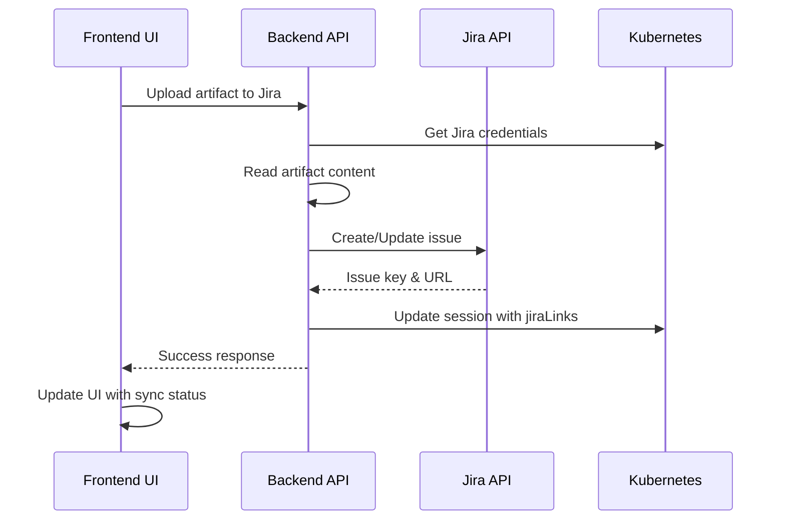

# Feature Specification: Jira Integration Restoration for vTeam Platform

## Executive Summary
Restore and modernize the Jira integration capabilities in the vTeam platform, enabling users to upload artifacts from the Shared Artifacts directory as Feature Specs to Jira issues. The integration will be refactored from the deprecated RFE workflow system to work with the current session-based architecture.

## Current State Analysis

### Existing Infrastructure
1. **Backend Components**
   - `/components/backend/jira/integration.go` - Contains commented-out Jira integration code
   - Secrets management supports Jira credentials (JIRA_URL, JIRA_PROJECT, JIRA_EMAIL, JIRA_API_TOKEN)
   - Integration secrets stored in `ambient-non-vertex-integrations` secret

2. **Frontend Components**
   - Settings UI has Jira configuration fields (currently functional)
   - API service methods exist but unused (`getWorkflowJiraIssue`, `publishWorkflowPathToJira`)
   - Types defined for Jira integration (`JiraLink` type)

3. **Data Model**
   - Session types include `jiraLinks` field for tracking synced files
   - Support for linking artifacts to Jira issues

## Proposed Solution

### Core Features

#### 1. Upload Artifacts to Jira
- **Functionality**: Upload any file from Shared Artifacts directory as a Feature Spec to Jira
- **Operations**:
  - Create new Jira issue with artifact content
  - Update existing Jira issue with new artifact version
  - Support markdown to Jira wiki format conversion
- **Metadata Tracking**: Store Jira issue key with artifact path

#### 2. Jira Sync Status Display
- **Visual Indicators**: Show sync status for each artifact file
  - Badge/icon indicating file is synced to Jira
  - Display Jira issue key (e.g., "PROJ-123")
  - Last sync timestamp
- **Location**: Integrate into existing WorkspaceTab component

#### 3. Jira Issue Navigation
- **Quick Actions**:
  - "View in Jira" button for synced files
  - Copy Jira issue link
  - Open Jira issue in new tab
- **Bulk Operations**: Select multiple artifacts for batch upload

#### 4. Bidirectional Sync (Phase 2)
- **Future Enhancement**: Pull comments/updates from Jira back to vTeam
- **Conflict Resolution**: Handle concurrent edits

## Technical Architecture

### Backend API Endpoints

```go
// Session-based Jira endpoints
POST   /api/projects/:projectName/sessions/:sessionName/jira/upload
GET    /api/projects/:projectName/sessions/:sessionName/jira/status
GET    /api/projects/:projectName/sessions/:sessionName/jira/issues
DELETE /api/projects/:projectName/sessions/:sessionName/jira/unlink
```

### Data Flow



### Component Updates

#### Backend Changes
1. **New Package**: `components/backend/jira/session_integration.go`
   - Refactor existing Jira code for session context
   - Implement new API handlers
   - Add authentication middleware

2. **Session Handler Updates**:
   - Add Jira-specific routes
   - Update session status with Jira links
   - Handle artifact content retrieval

3. **Jira API Client**:
   - REST API v2/v3 support
   - Issue creation/update
   - Attachment handling
   - Wiki format conversion

#### Frontend Changes
1. **WorkspaceTab Enhancement**:
   - Add Jira sync status indicators
   - Context menu for Jira operations
   - Bulk selection support

2. **New Components**:
   - `JiraUploadDialog`: Configure upload parameters
   - `JiraSyncStatus`: Display sync information
   - `JiraIssueBadge`: Visual indicator component

3. **API Service Updates**:
   - New Jira service methods
   - Session-based endpoints
   - Error handling

## Implementation Plan

### Phase 1: Core Restoration (Week 1-2)
1. Uncomment and refactor backend Jira integration
2. Create session-based API endpoints
3. Test Jira authentication and basic operations

### Phase 2: UI Integration (Week 2-3)
1. Add Jira sync UI components
2. Integrate with WorkspaceTab
3. Implement upload dialog

### Phase 3: Enhanced Features (Week 3-4)
1. Bulk operations
2. Sync status persistence
3. Error recovery mechanisms

### Phase 4: Testing & Polish (Week 4)
1. End-to-end testing
2. Error handling improvements
3. Documentation

## User Experience

### Workflow
1. User navigates to Shared Artifacts in session
2. Right-clicks on artifact file
3. Selects "Upload to Jira"
4. Configures upload (new issue or update existing)
5. Confirms upload
6. Views sync status badge on file
7. Can click to view in Jira

### Configuration
- One-time setup in Project Settings
- Enter Jira URL, project key, credentials
- Test connection button
- Credentials stored securely in K8s secrets

## Security Considerations

1. **Authentication**:
   - Use Jira API tokens (not passwords)
   - Store credentials in K8s secrets
   - Per-project isolation

2. **Authorization**:
   - Respect project permissions
   - Audit trail for uploads
   - Rate limiting

3. **Data Protection**:
   - Encrypt credentials at rest
   - Use HTTPS for Jira communication
   - Sanitize file content

## Success Metrics

1. **Functional Metrics**:
   - Successful upload rate > 95%
   - Average upload time < 5 seconds
   - Zero data loss incidents

2. **User Adoption**:
   - 50% of active users utilize Jira integration
   - Reduced manual copy-paste operations
   - Positive user feedback

## Risks & Mitigations

| Risk | Impact | Mitigation |
|------|--------|------------|
| Jira API changes | High | Version lock API client, monitor deprecations |
| Large file uploads | Medium | Implement file size limits, streaming uploads |
| Credential exposure | High | Use K8s secrets, audit access |
| Network failures | Medium | Retry logic, queue failed uploads |

## Future Enhancements

1. **Bidirectional Sync**: Pull Jira comments back to vTeam
2. **Template Support**: Pre-configured issue templates
3. **Workflow Integration**: Auto-upload on workflow completion
4. **Analytics Dashboard**: Track integration usage
5. **Multi-project Support**: Cross-project artifact sharing

## Dependencies

- Jira Cloud/Server API access
- User Jira credentials
- Network connectivity to Jira instance
- Kubernetes secrets management

## Acceptance Criteria

- [ ] Users can upload artifacts to Jira from UI
- [ ] Sync status is visible on artifact files
- [ ] Jira issues can be opened from UI
- [ ] Configuration is secure and per-project
- [ ] Error handling provides clear feedback
- [ ] Performance meets defined metrics
- [ ] Documentation is complete