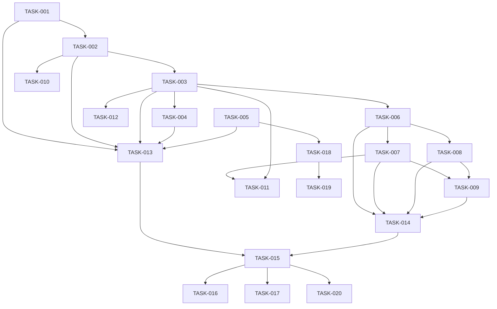

# Implementation Tasks: Jira Integration Restoration

## Task Breakdown

### Phase 1: Backend Foundation (Priority: Critical)

#### TASK-001: Refactor Jira Integration Package
**Type**: Backend Development
**Effort**: 4 hours
**Dependencies**: None
**Assigned to**: Backend Team

**Description**: Uncomment and refactor the existing Jira integration code to work with sessions instead of RFE workflows.

**Subtasks**:
1. Copy `components/backend/jira/integration.go` to `components/backend/jira/session_integration.go`
2. Uncomment the code and update imports
3. Replace RFE-specific logic with session-based logic
4. Update function signatures to accept session context
5. Add proper error handling for session operations

**Acceptance Criteria**:
- [ ] New session_integration.go file created
- [ ] All functions updated to use session context
- [ ] Code compiles without errors
- [ ] Unit tests pass

---

#### TASK-002: Create Jira API Client
**Type**: Backend Development
**Effort**: 3 hours
**Dependencies**: TASK-001
**Assigned to**: Backend Team

**Description**: Implement a robust Jira API client with proper authentication and error handling.

**Subtasks**:
1. Create `components/backend/jira/client.go`
2. Implement authentication using API tokens
3. Add methods for issue creation and update
4. Implement attachment upload
5. Add retry logic for network failures

**Code Template**:
```go
type JiraClient struct {
    baseURL  string
    email    string
    apiToken string
    client   *http.Client
}

func (c *JiraClient) CreateIssue(issue *Issue) (*IssueResponse, error)
func (c *JiraClient) UpdateIssue(key string, fields map[string]interface{}) error
func (c *JiraClient) AddAttachment(issueKey string, content []byte, filename string) error
```

---

#### TASK-003: Implement Session Jira Handlers
**Type**: Backend Development
**Effort**: 4 hours
**Dependencies**: TASK-002
**Assigned to**: Backend Team

**Description**: Create new API handlers for Jira operations in session context.

**Files to Create**:
- `components/backend/handlers/jira_session.go`

**Endpoints to Implement**:
1. `POST /api/projects/:projectName/sessions/:sessionName/jira/upload`
2. `GET /api/projects/:projectName/sessions/:sessionName/jira/status`
3. `GET /api/projects/:projectName/sessions/:sessionName/jira/issues`
4. `DELETE /api/projects/:projectName/sessions/:sessionName/jira/unlink`

---

#### TASK-004: Update Route Configuration
**Type**: Backend Development
**Effort**: 1 hour
**Dependencies**: TASK-003
**Assigned to**: Backend Team

**Description**: Add new Jira routes to the backend router.

**File to Modify**: `components/backend/routes.go`

**Changes**:
```go
// Add to projectGroup routes
projectGroup.POST("/sessions/:sessionName/jira/upload", handlers.UploadArtifactToJira)
projectGroup.GET("/sessions/:sessionName/jira/status", handlers.GetJiraSyncStatus)
projectGroup.GET("/sessions/:sessionName/jira/issues", handlers.GetJiraIssues)
projectGroup.DELETE("/sessions/:sessionName/jira/unlink", handlers.UnlinkJiraIssue)
```

---

#### TASK-005: Extend Session CRD Schema
**Type**: Backend Development
**Effort**: 2 hours
**Dependencies**: None
**Assigned to**: Backend Team

**Description**: Update the AgenticSession CRD to include Jira link tracking.

**Files to Modify**:
- Session type definitions
- CRD YAML manifests

**Schema Addition**:
```go
type JiraLink struct {
    ArtifactPath string    `json:"artifactPath"`
    IssueKey     string    `json:"issueKey"`
    IssueURL     string    `json:"issueUrl"`
    SyncedAt     time.Time `json:"syncedAt"`
}
```

---

### Phase 2: Frontend Foundation (Priority: Critical)

#### TASK-006: Create Jira API Service
**Type**: Frontend Development
**Effort**: 2 hours
**Dependencies**: TASK-003
**Assigned to**: Frontend Team

**Description**: Implement frontend API service for Jira operations.

**File to Create**: `components/frontend/src/services/api/jira.ts`

**Methods to Implement**:
- `uploadArtifactToJira()`
- `getJiraSyncStatus()`
- `getJiraIssues()`
- `unlinkJiraIssue()`

---

#### TASK-007: Create Jira Upload Dialog Component
**Type**: Frontend Development
**Effort**: 4 hours
**Dependencies**: TASK-006
**Assigned to**: Frontend Team

**Description**: Build the UI dialog for uploading artifacts to Jira.

**File to Create**: `components/frontend/src/components/jira/JiraUploadDialog.tsx`

**Features**:
- Form for issue summary and description
- Option to create new or update existing issue
- Loading states and error handling
- Success feedback

---

#### TASK-008: Add Jira Sync Indicators
**Type**: Frontend Development
**Effort**: 3 hours
**Dependencies**: TASK-006
**Assigned to**: Frontend Team

**Description**: Add visual indicators showing Jira sync status on artifact files.

**Files to Modify**:
- `components/frontend/src/components/session/WorkspaceTab.tsx`
- Create `components/frontend/src/components/jira/JiraSyncBadge.tsx`

**UI Elements**:
- Jira icon badge on synced files
- Issue key display
- Last sync timestamp
- "View in Jira" link

---

#### TASK-009: Integrate Context Menu Actions
**Type**: Frontend Development
**Effort**: 2 hours
**Dependencies**: TASK-007, TASK-008
**Assigned to**: Frontend Team

**Description**: Add Jira actions to the file context menu in WorkspaceTab.

**Context Menu Items**:
- "Upload to Jira" (for unsynced files)
- "Update in Jira" (for synced files)
- "View in Jira" (for synced files)
- "Unlink from Jira" (for synced files)

---

### Phase 3: Integration & Polish (Priority: High)

#### TASK-010: Implement Markdown to Wiki Conversion
**Type**: Backend Development
**Effort**: 3 hours
**Dependencies**: TASK-002
**Assigned to**: Backend Team

**Description**: Convert markdown artifact content to Jira wiki format.

**File to Create**: `components/backend/jira/converter.go`

**Conversions Needed**:
- Headers (# -> h1.)
- Code blocks (``` -> {code})
- Lists (* -> *, 1. -> #)
- Links ([text](url) -> [text|url])
- Tables

---

#### TASK-011: Add Bulk Upload Support
**Type**: Full-stack Development
**Effort**: 4 hours
**Dependencies**: TASK-007, TASK-003
**Assigned to**: Full-stack Team

**Description**: Enable users to upload multiple artifacts to Jira at once.

**Backend Changes**:
- New endpoint: `POST /api/projects/:projectName/sessions/:sessionName/jira/bulk-upload`

**Frontend Changes**:
- Multi-select in file tree
- Bulk upload dialog
- Progress indicator

---

#### TASK-012: Implement Error Recovery
**Type**: Backend Development
**Effort**: 3 hours
**Dependencies**: TASK-003
**Assigned to**: Backend Team

**Description**: Add robust error handling and recovery mechanisms.

**Features**:
- Retry queue for failed uploads
- Graceful degradation on Jira unavailability
- Clear error messages to frontend
- Audit logging

---

### Phase 4: Testing & Documentation (Priority: High)

#### TASK-013: Write Backend Unit Tests
**Type**: Testing
**Effort**: 4 hours
**Dependencies**: TASK-001 through TASK-005
**Assigned to**: Backend Team

**Test Coverage**:
- Jira client methods
- API handlers
- Markdown conversion
- Error scenarios

---

#### TASK-014: Write Frontend Unit Tests
**Type**: Testing
**Effort**: 3 hours
**Dependencies**: TASK-006 through TASK-009
**Assigned to**: Frontend Team

**Test Coverage**:
- Upload dialog component
- Sync status display
- API service methods
- Error handling

---

#### TASK-015: Create E2E Tests
**Type**: Testing
**Effort**: 4 hours
**Dependencies**: All development tasks
**Assigned to**: QA Team

**Test Scenarios**:
- Complete upload flow
- Update existing issue
- View in Jira
- Error recovery
- Bulk operations

---

#### TASK-016: Write User Documentation
**Type**: Documentation
**Effort**: 3 hours
**Dependencies**: All development tasks
**Assigned to**: Technical Writer

**Documentation Sections**:
- Configuration guide
- Upload walkthrough
- Troubleshooting
- FAQ

---

#### TASK-017: Create Admin Documentation
**Type**: Documentation
**Effort**: 2 hours
**Dependencies**: All development tasks
**Assigned to**: Technical Writer

**Documentation Sections**:
- Security setup
- Performance tuning
- Monitoring configuration
- Backup/recovery

---

### Phase 5: Deployment & Monitoring (Priority: Medium)

#### TASK-018: Update Kubernetes Manifests
**Type**: DevOps
**Effort**: 2 hours
**Dependencies**: TASK-005
**Assigned to**: DevOps Team

**Changes**:
- Update CRD definitions
- Add RBAC rules for Jira operations
- Update deployment configurations

---

#### TASK-019: Add Monitoring & Metrics
**Type**: DevOps
**Effort**: 3 hours
**Dependencies**: All development tasks
**Assigned to**: DevOps Team

**Metrics to Add**:
- Upload success/failure rates
- Average upload duration
- Jira API response times
- Error rates by type

---

#### TASK-020: Performance Testing
**Type**: Testing
**Effort**: 3 hours
**Dependencies**: All development tasks
**Assigned to**: QA Team

**Tests**:
- Load testing with concurrent uploads
- Large file handling
- Network latency simulation
- Memory leak detection

---

## Task Dependencies Graph



## Execution Order

### Sprint 1 (Week 1)
1. TASK-001: Refactor Jira Integration Package
2. TASK-005: Extend Session CRD Schema (parallel)
3. TASK-002: Create Jira API Client
4. TASK-003: Implement Session Jira Handlers
5. TASK-004: Update Route Configuration
6. TASK-006: Create Jira API Service

### Sprint 2 (Week 2)
7. TASK-007: Create Jira Upload Dialog
8. TASK-008: Add Jira Sync Indicators
9. TASK-009: Integrate Context Menu Actions
10. TASK-010: Implement Markdown to Wiki Conversion
11. TASK-013: Write Backend Unit Tests
12. TASK-014: Write Frontend Unit Tests

### Sprint 3 (Week 3)
13. TASK-011: Add Bulk Upload Support
14. TASK-012: Implement Error Recovery
15. TASK-015: Create E2E Tests
16. TASK-018: Update Kubernetes Manifests
17. TASK-019: Add Monitoring & Metrics

### Sprint 4 (Week 4)
18. TASK-020: Performance Testing
19. TASK-016: Write User Documentation
20. TASK-017: Create Admin Documentation

## Risk Mitigation

| Task | Risk | Mitigation |
|------|------|------------|
| TASK-002 | Jira API compatibility | Test against multiple Jira versions |
| TASK-005 | CRD migration issues | Provide migration script |
| TASK-010 | Complex markdown conversion | Use existing library if available |
| TASK-011 | Performance with bulk uploads | Implement queuing and rate limiting |
| TASK-020 | Performance bottlenecks | Profile early and often |

## Success Metrics

- All 20 tasks completed within 4 weeks
- Test coverage > 80%
- Zero critical bugs in production
- Upload success rate > 95%
- User adoption rate > 50% within first month